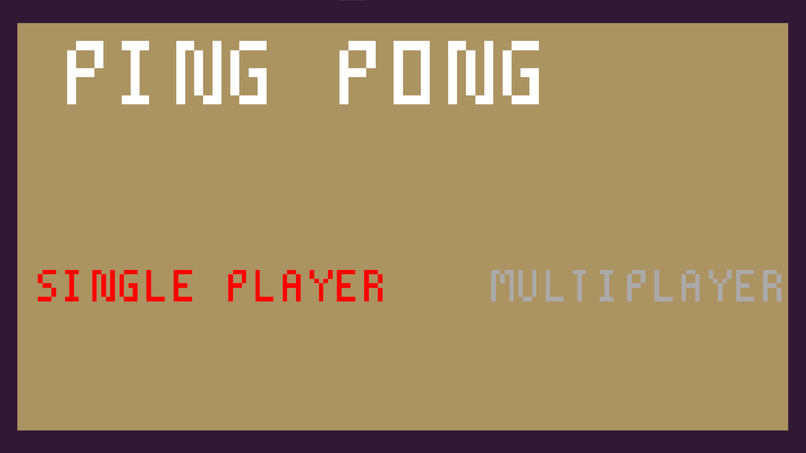
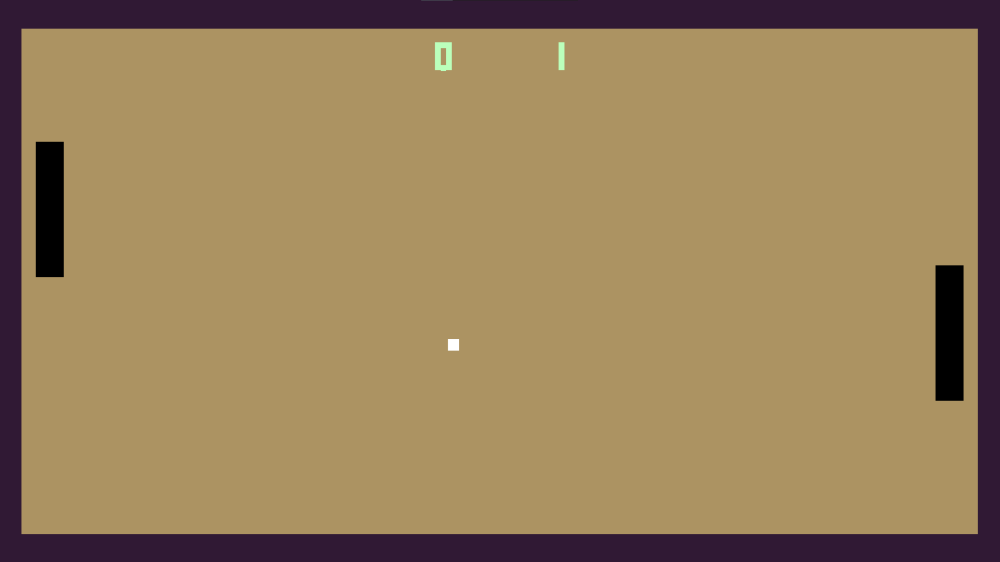

# Ping Pong Game

Welcome to the **Ping Pong Game**, a simple yet engaging C++ project created to explore and learn something new while having fun! This project demonstrates the basics of game development using pure C++ without relying on any external frameworks. It’s a great way to dive into foundational programming concepts while building something entertaining.

---

### Key Components:

1. **Game Loop**: Continuously updates the game state, rendering the screen and checking for user input.
2. **Collision Detection**: Ensures the ball reacts appropriately when it hits a paddle or wall.
3. **Score Tracking**: Keeps track of each player’s score and displays it on the screen.
4. **Controls**: Keyboard-based input for moving the paddles.

---

## Screenshots

### Main Menu

### Gameplay

